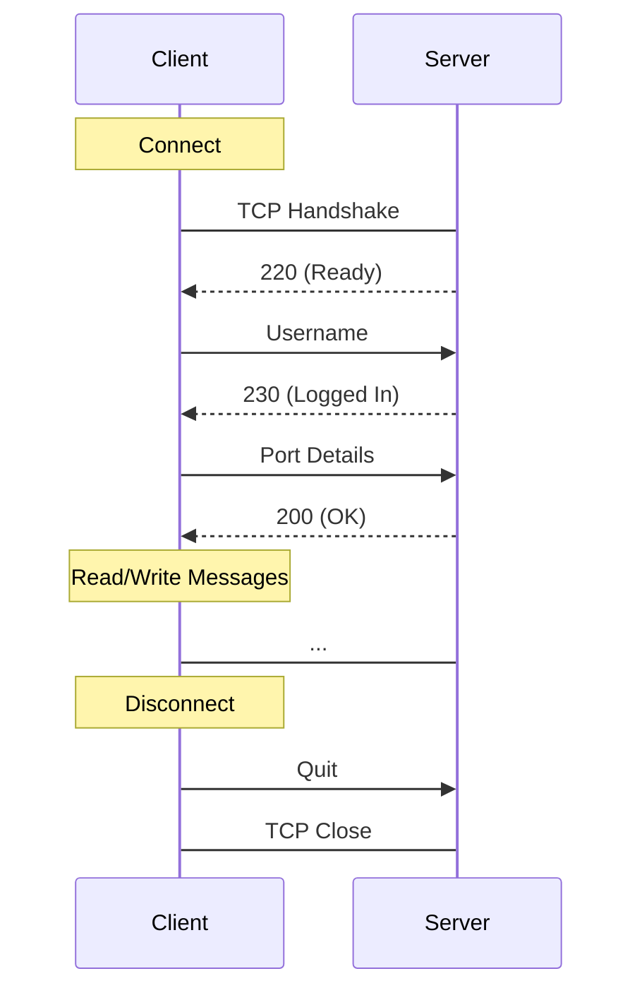

# FTP
- Data can be transferred as stream or block mode
- Uses telnet strings for commands
- Simple packet structure
- Requires two ports on a client, one for sending and the other for receiving
- Maintains a stateful connection
- https://datatracker.ietf.org/doc/html/rfc959

