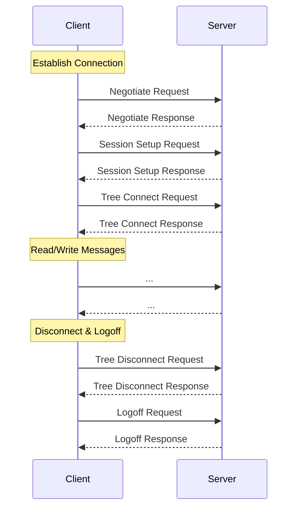

# SMB2
- Block-Level transfer, (however block size is not limited unlike SMB1)
- Utilises pipelining, sending other requests before a response is received
- Can send multiple actions in a single request
- Only 19 commands
- When running over TCP requires one port making use of TCP's full-duplex capability
- Maintains stateful  connection
- Complex connection negotiation, requiring multiple message exchanges before a transfer can be accomplished
    1.  Negotiate (establish which protocol version is being used)
    2. Session Setup (auth tokens and such)
    3. Tree Connect (connect to a share)
    4. ...
    5. Tree Disconnect
    6. Logoff
- [Source](https://learn.microsoft.com/en-us/openspecs/windows_protocols/ms-smb2/5606ad47-5ee0-437a-817e-70c366052962)

