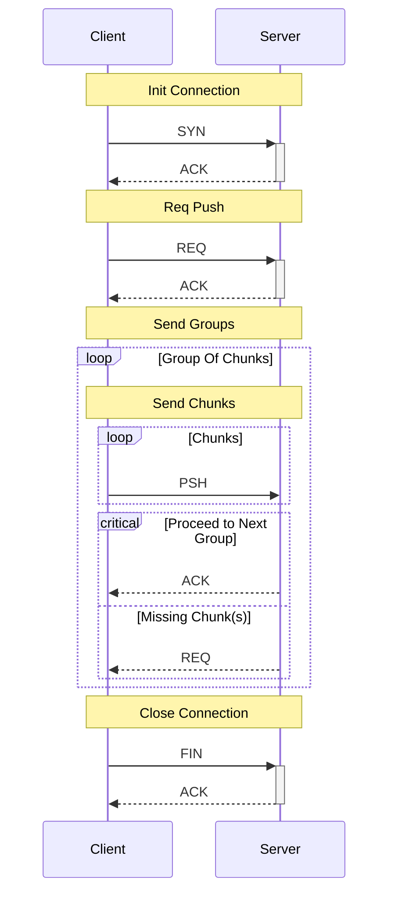

# Prototype 1

## Structure
### Packet

```
|----------|
| Type     |
| Header   |
| Metadata |
| Payload  |
|----------|
```

### Packet Types

| Prefix | Note                              |
| :----- | :-------------------------------- |
| SYN    | Open connection                   |
| ACK    | Acknowledge a request/action      |
| REQ    | Request to send or receive PSH    |
| PSH    | Send a payload (sent after a REQ) |
| FIN    | Close connection                  |


## Client File Push


