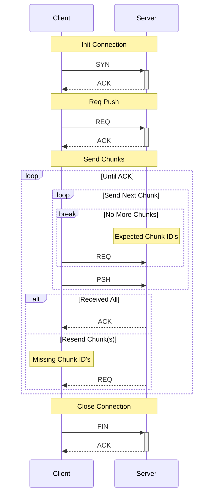

# Prototype 1
This prototype I will test my first design of the protocol. It will only include the features listed below:

- Very basic error correction
- Dummy Handshake
- Send real file(s) from client to server
  - Handle resend of missing file packets
- Customisable MTU size for testing
- Dummy connection close

## Usage
Adjustable MTU size through the `NET_MTU` environment variable.

### Server

```
go run . server 127.0.0.1:9000
```

### Client

```
go run . client 127.0.0.1:9000 <file path 1> [<file path 2>, <file path 3>...]

or

go run . client 127.0.0.1:9000 <directory path>
```

## Discovered Issues
- If a large amount of packets are dropped during a PSH the REQ for resend packet will not be able to contain all chunk id's in one go
  - Send chunks in groups, say 5 chunks at a time then ACK; then another 5?
- Header must be decoded before metadata can be interpreted.
  - Fix by combining header+metadata by combining types e.g. SYN-ACK and having optional fields in protobuf spec?
- Header Length & Metadata length have a reserved uint64 of space. This is wasted as we would never have a header which is 18446744073709551615 bytes long
  - Fix by reserving uint16 instead?

## Structure
### Packet

```
|-----------------|----------|
| Type            | uint8    |
| Header Length   | uint64   |
| Header          | protobuf |
| Metadata Length | uint64   |
| Metadata        | protobuf |
| Payload Length  | uint64   |
| Payload         | binary   |
|-----------------|----------|
```

### Example - SYN

```
|-------------------|
| 1                 | <- Packet Type
| 5                 | <- Header Length
| {id: 1, mtu: 470} | <- Protobuf Header
| 0                 | <- No Metadata
| 0                 | <- No Payload
|-------------------|
```

```
 1 0 0 0 0 0 0 0 5 8 1 16 214 3 0 0 0 0 0 0 0 0 0 0 0 0 0 0 0 0
 ^ ^^^^^^^^^^^^^^^ ^^^^^^^^^^^^ ^^^^^^^^^^^^^^^ ^^^^^^^^^^^^^^^
 |        |             |              |               |
Type    Header        Header        Metadata        Payload
        Length                       Length         Length
```

### Packet Types

| Prefix | Value | Note                              |
| :----- | :---- | :-------------------------------- |
| SYN    | 1     | Open connection                   |
| ACK    | 2     | Acknowledge a request/action      |
| REQ    | 3     | Request to send or receive PSH    |
| PSH    | 4     | Send a payload (sent after a REQ) |
| FIN    | 254   | Close connection                  |


## Client File Push


