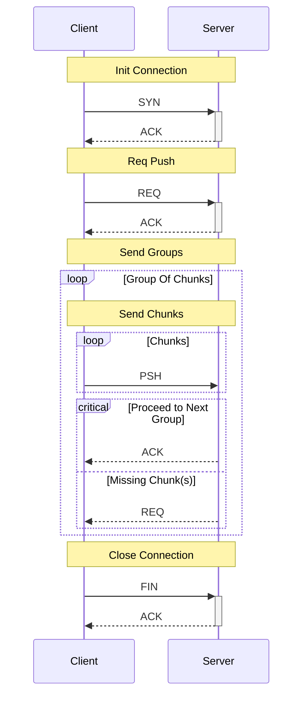

# Prototype 1

## Structure
### Packet

```
|--------------|----------|
| Type         | uint8    |
| Header Size  | uint64   |
| Header       | protobuf |
| Metadata     | protobuf |
| Payload Size | uint64   |
| Payload      | binary   |
|--------------|----------|
```

### Packet Types

| Prefix | Value | Note                              |
| :----- | :-----| :-------------------------------- |
| SYN    | 1     | Open connection                   |
| ACK    | 2     | Acknowledge a request/action      |
| REQ    | 3     | Request to send or receive PSH    |
| PSH    | 4     | Send a payload (sent after a REQ) |
| FIN    | 254   | Close connection                  |


## Client File Push


