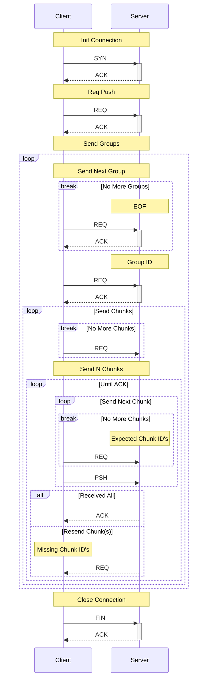

# Prototype 2
This prototype I will alter the first prototype to improve handling of when lots of packets go missing during a file transfer. It will only include the features listed below:

- Very basic error correction
- Dummy Handshake
- Send one real file from client to server
  - Handle resend of missing file packets
  - Grouped packets
- Customisable MTU size for testing
- Dummy connection close

## Usage
Same as proto-1

## Discovered Issues
TBD.

## Structure
Same as proto-1

## Client File Push

