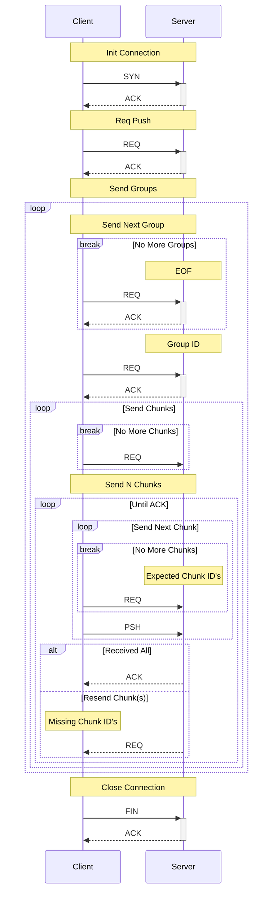

# Prototype 2A

## Usage
No prototype, as superseded by 2B.

## Discovered Issues
- Adding validated groups with id's would add a lot of unneeded complexity (solved in 2B)

```mermaid
sequenceDiagram
    Note over Client,Server: Init Connection
    Client->>+Server: SYN
    Server-->>-Client: ACK
    Note over Client,Server: Req Push
    Client ->>+ Server: REQ
    Server -->>- Client: ACK
    Note over Client,Server: Send Groups
    loop
        Note over Client,Server: Send Next Group
        break No More Groups
            Note over Server: EOF
            Client->>+ Server: REQ
            Server -->>- Client: ACK
        end
        Note over Server: Group ID
        Client->>+ Server: REQ
        Server -->>- Client: ACK
        loop Send Chunks
            break No More Chunks
                Client ->> Server: REQ
            end
            Note over Client,Server: Send N Chunks
            loop Until ACK
                loop Send Next Chunk
                    break No More Chunks
                        Note over Server: Expected Chunk ID's
                        Client ->> Server: REQ
                    end
                    Client ->> Server: PSH
                end
                alt Received All
                    Server -->> Client: ACK
                else Resend Chunk(s)
                    Note over Client: Missing Chunk ID's
                    Server -->> Client: REQ
                end
            end
        end
    end
    Note over Client,Server: Close Connection
    Client->>+ Server: FIN
    Server -->>- Client: ACK
```
