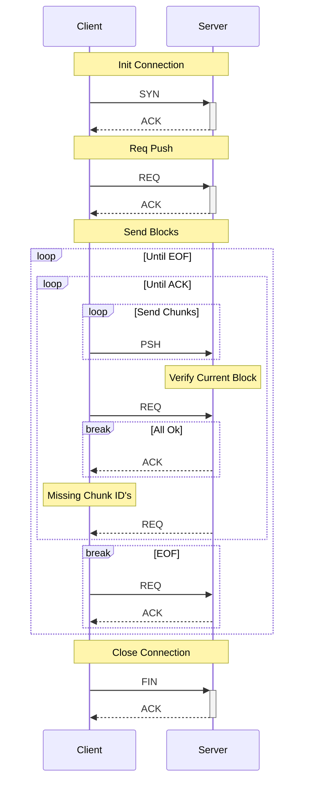

# Prototype 2B
This prototype I will alter the first prototype to improve handling of when lots of packets go missing during a file transfer. It will only include the features listed below:

- Very basic error correction
- Dummy Handshake
- Send one real file from client to server
  - Handle resend of missing file packets
  - Send chunks in blocks and verify at each block (receiver get's a more ordered send if there is packet loss)
  - Blocks are entirely handled by the sender, receiver does not need to keep track of them (reduces complexity)
  - EOF request message, used to close the file
- Customisable MTU size for testing
- Dummy connection close

## Usage
Same as proto-1

## Discovered Issues
- Server cannot predict number of chunks in a block, due to being determined by client. If server could predict chunks per block; a buffer could be pre allocated reducing memory allocations

## Fixed Issues
- (cae32ef) file reader cursor position not set back after a requested resend, causing incorrect data to be sent on next PSH. Fixed by seeking to stored seek offset before reading

## Structure
Same as proto-1

## Client File Push

