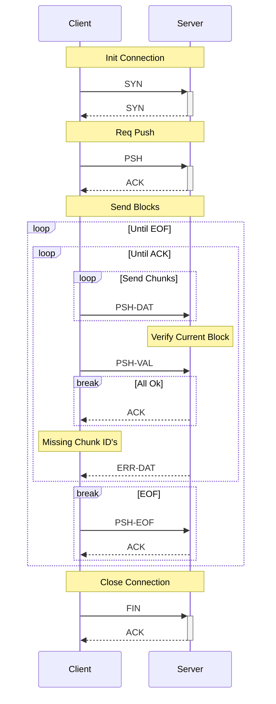

# Prototype 3
This prototype I will improve on proto-1 & proto-2B. This will include:

- Removing the need to send two protobuf payloads for each message
- Replace complex protobuf payloads with more message types reducing protobuf fields
- Have specific request and response message types, reducing complexity of validation
- New "req-sub-id" for chunk verification and eof messages
- All REQ that are sent will increment at least the req-id or req-sub-id
- Reduce overhead for length counter in message (but still support jumbo-frames & IPv6 Jumbograms)
  - Header length will be uint32 instead of uint64
  - Payload length will be uint32 instead of uint64

## Usage
### Environment Variables
- Adjust packet size `NET_MTU` (client, server)
- How many chunks to send before a verification `CHUNKS_PER_BLOCK` (client)
- How long to wait before sending message again `TIMEOUT_MS` (client)

### Server

```
go run . server 127.0.0.1:9000
```

### Client

```
go run . client 127.0.0.1:9000 <file path 1> [<file path 2>, <file path 3>...]

or

go run . client 127.0.0.1:9000 <directory path>
```

## Discovered Issues
TBD

## Fixed Issues
TBD

## Structure
### Packet

```
|-----------------|----------|
| Type            | uint8    |
| Header Length   | uint32   |
| Header          | protobuf |
| Payload Length  | uint32   |
| Payload         | binary   |
|-----------------|----------|
```

### Message Types

- REQ
  - SYN (start connection, send capabilities)
  - FIN (finalise connection, close)
  - PSH (request to push a object)
    - DAT (a chunk of the object)
    - VAL (request to receiver to validate their received chunks)
    - EOF (mark object EOF, PSH finished, sent only after EOF & PSH-VAL receives ACK)
- RES
  - SYN (reply to REQ-SYN, send capabilities)
  - ACK (acknowledge a REQ)
  - ERR
    - DAT (chunk id's to re-send, sent in reply to a PSH-VAL)

## Client File Push


